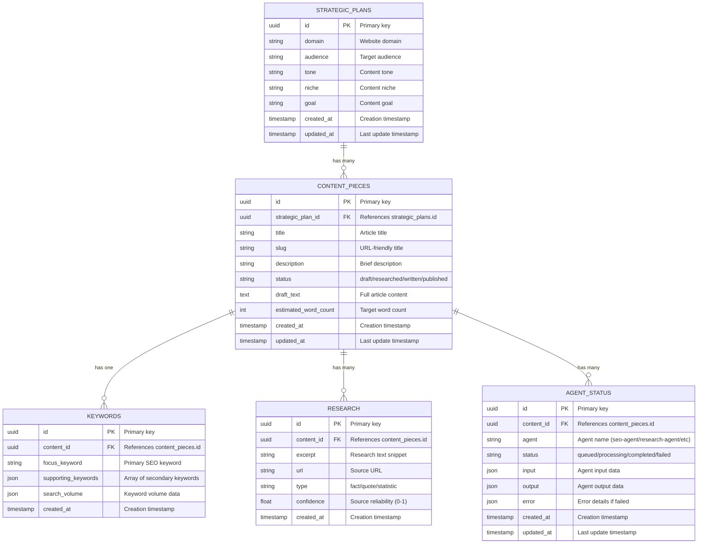

# Database Schema

This document provides a detailed overview of the WordPress Content Generator database schema, showing the structure of each table and the relationships between them.

## Database Schema Diagram

## Table Descriptions

### strategic_plans

The strategic_plans table defines the high-level content strategy for a specific domain. Each strategic plan serves as the foundation for multiple content pieces.

- **id**: UUID primary key
- **domain**: Website domain for the content strategy
- **audience**: Target audience description
- **tone**: Content tone (e.g., informative, conversational, professional)
- **niche**: Content niche or industry focus
- **goal**: Content marketing goal (e.g., educate, generate leads, build authority)
- **created_at**: Timestamp when the plan was created
- **updated_at**: Timestamp when the plan was last updated

### content_pieces

The content_pieces table tracks individual articles through the content pipeline. Each piece is associated with a strategic plan and progresses through various status stages.

- **id**: UUID primary key
- **strategic_plan_id**: Foreign key referencing strategic_plans.id
- **title**: Article title
- **slug**: URL-friendly version of the title
- **description**: Brief article description or summary
- **status**: Current status in the pipeline (draft, researched, written, published)
- **draft_text**: Full article content (markdown format)
- **estimated_word_count**: Target word count for the article
- **created_at**: Timestamp when the content piece was created
- **updated_at**: Timestamp when the content piece was last updated

### keywords

The keywords table stores SEO keyword information for each content piece. Each content piece has one set of keywords.

- **id**: UUID primary key
- **content_id**: Foreign key referencing content_pieces.id
- **focus_keyword**: Primary SEO keyword for the article
- **supporting_keywords**: JSON array of secondary keywords
- **search_volume**: JSON object with search volume data for keywords
- **created_at**: Timestamp when the keywords were created

### research

The research table contains research data gathered for each content piece. Each content piece can have multiple research entries.

- **id**: UUID primary key
- **content_id**: Foreign key referencing content_pieces.id
- **excerpt**: Research text snippet (fact, quote, statistic)
- **url**: Source URL for the research
- **type**: Type of research (fact, quote, statistic)
- **confidence**: Source reliability score (0.0 to 1.0)
- **created_at**: Timestamp when the research was created

### agent_status

The agent_status table logs the execution status of each agent for each content piece. This provides a complete audit trail of the content pipeline.

- **id**: UUID primary key
- **content_id**: Foreign key referencing content_pieces.id
- **agent**: Name of the agent (seo-agent, research-agent, draft-writer-agent)
- **status**: Current status (queued, processing, completed, failed)
- **input**: JSON object containing the agent's input data
- **output**: JSON object containing the agent's output data
- **error**: JSON object with error details if the agent failed
- **created_at**: Timestamp when the agent status was created
- **updated_at**: Timestamp when the agent status was last updated

## Relationships

1. A **strategic plan** can have many **content pieces**
2. A **content piece** has one set of **keywords**
3. A **content piece** can have many **research** entries
4. A **content piece** can have many **agent status** entries (one per agent execution)
