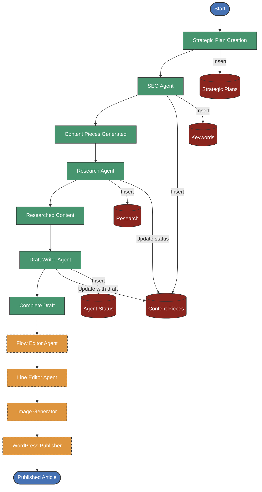

# Content Generation Pipeline Architecture

This document visualizes the WordPress Content Generator pipeline flow, showing how data moves through the system from strategic planning to final content publication.

## Pipeline Flow Diagram

## Component Description

### Current Pipeline Components

1. **Strategic Plan Creation**: Defines the overall content strategy for a domain, including audience, tone, niche, and goals.

2. **SEO Agent**: Analyzes the strategic plan to generate:
   - Focus keywords and supporting keywords
   - Content ideas with titles, descriptions, and structure

3. **Research Agent**: For each content piece, gathers:
   - Facts and statistics from reliable sources
   - Quotes and expert opinions
   - Citations with URLs

4. **Draft Writer Agent**: Combines research and SEO data to create:
   - Complete article drafts with proper structure
   - SEO-optimized content with keywords properly placed
   - Citations integrated into the content

### Future Pipeline Components

5. **Flow Editor Agent**: Will improve the overall structure and flow of the article.

6. **Line Editor Agent**: Will polish grammar, style, and readability.

7. **Image Generator**: Will create featured images and in-article visuals.

8. **WordPress Publisher**: Will format and publish the final content to WordPress via the REST API.

### Database Interactions

The system uses a Supabase (PostgreSQL) database with the following key tables:

- **Strategic Plans**: Stores content strategy information
- **Content Pieces**: Tracks articles through the pipeline
- **Keywords**: Stores SEO keywords for each content piece
- **Research**: Contains facts, quotes, and citations
- **Agent Status**: Logs agent execution and status

Each agent reads from and writes to these tables, creating a data-driven pipeline where each step builds on the previous one.
