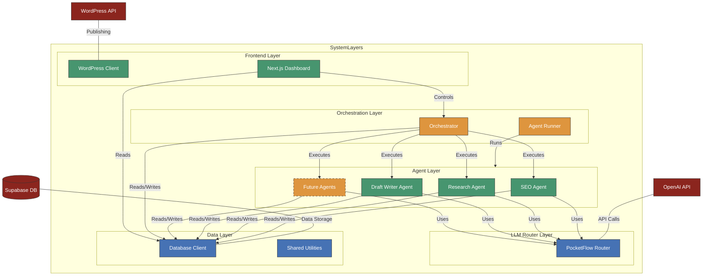

# System Components Architecture

This document provides a comprehensive overview of the WordPress Content Generator system architecture, showing how different components interact with each other and with external services.

## System Architecture Diagram

## Component Descriptions

### External Services

1. **OpenAI API**: Provides the AI models (GPT-4, GPT-3.5) that power the content generation capabilities.
   - Used for keyword analysis, content ideation, research, and draft writing
   - Accessed through the PocketFlow router for consistent handling

2. **Supabase**: PostgreSQL database and storage solution.
   - Stores all structured data (strategic plans, content pieces, keywords, research)
   - Provides real-time updates for the dashboard
   - Handles authentication for the frontend

3. **WordPress API**: REST API for publishing content to WordPress sites.
   - Handles authentication via app passwords
   - Manages post creation, updates, and media uploads

### System Layers

#### LLM Router Layer

1. **PocketFlow Router**: Manages communication with language models.
   - Routes requests to appropriate AI providers
   - Handles rate limiting and retries
   - Provides consistent interface for all agents

#### Agent Layer

1. **SEO Agent**: Generates SEO-optimized content plans.
   - Analyzes strategic plans to identify keywords
   - Generates content ideas with titles and structure
   - Stores results in the database

2. **Research Agent**: Gathers supporting information for content.
   - Collects facts, statistics, and quotes
   - Validates sources and assigns confidence scores
   - Stores research data in the database

3. **Draft Writer Agent**: Creates complete article drafts.
   - Combines SEO keywords and research data
   - Generates well-structured, SEO-optimized content
   - Integrates citations and references properly

4. **Future Agents**: Planned for upcoming sprints.
   - Flow Editor Agent: Improves content structure
   - Line Editor Agent: Polishes grammar and style
   - Image Generator: Creates featured images
   - WordPress Publisher: Formats and publishes content

#### Orchestration Layer

1. **Orchestrator**: Manages the end-to-end content pipeline.
   - Coordinates agent execution in the correct sequence
   - Handles error recovery and retries
   - Updates status tracking in the database
   - Provides CLI interface for manual execution

2. **Agent Runner**: Utility for executing individual agents.
   - Standardizes agent execution
   - Captures and processes agent outputs
   - Manages environment variables and configuration

#### Data Layer

1. **Database Client**: Wrapper for Supabase interactions.
   - Provides consistent interface for database operations
   - Handles connection management
   - Implements data validation and error handling

2. **Shared Utilities**: Common functions used across the system.
   - Data transformation helpers
   - Logging utilities
   - Configuration management

#### Frontend Layer

1. **Next.js Dashboard**: Monitoring and control interface.
   - Displays pipeline status and content progress
   - Allows manual intervention and control
   - Provides analytics and reporting

2. **WordPress Client**: Handles WordPress API interactions.
   - Manages authentication and session handling
   - Formats content for WordPress
   - Handles media uploads and post publishing

## Data Flow

1. **Content Creation Flow**:
   - Strategic plan created in database
   - Orchestrator triggers SEO Agent
   - SEO Agent generates content pieces
   - Orchestrator triggers Research Agent for each content piece
   - Research Agent gathers and stores research data
   - Orchestrator triggers Draft Writer Agent
   - Draft Writer creates complete article drafts
   - (Future) Flow and Line Editors refine content
   - (Future) Image Generator creates visuals
   - (Future) WordPress Publisher posts to CMS

2. **Monitoring Flow**:
   - Agents update status in database
   - Dashboard reads status from database
   - Users view progress and analytics
   - Users can trigger manual actions via dashboard

3. **Error Handling Flow**:
   - Agents report errors to database
   - Orchestrator detects failures
   - Orchestrator implements retry logic
   - Dashboard displays error states
   - Users can manually intervene
